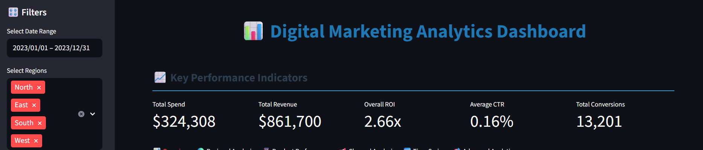
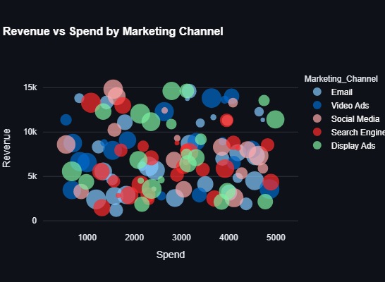
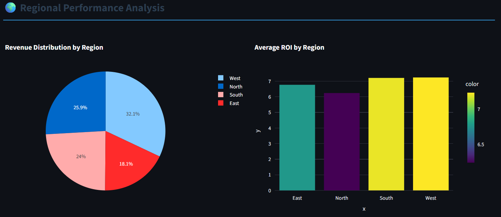
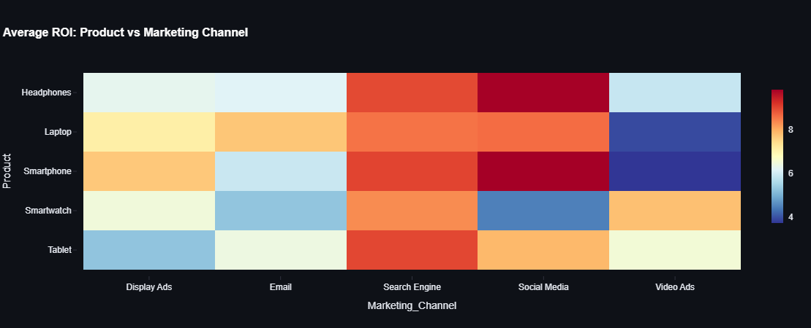
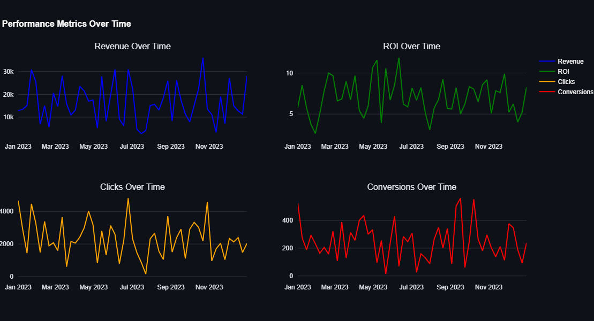
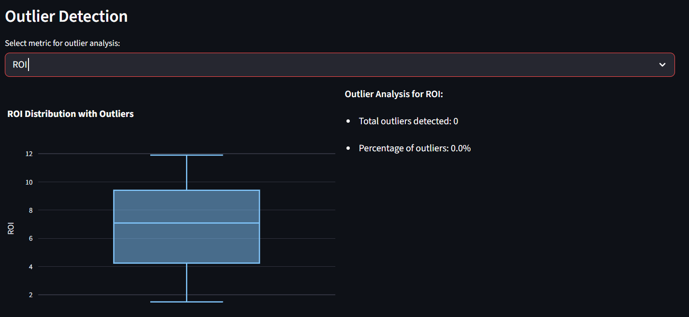

# Digital Marketing Analytics Dashboard

A comprehensive **Digital Marketing Analytics Dashboard** built with [Streamlit](https://streamlit.io/), [Pandas](https://pandas.pydata.org/), [NumPy](https://numpy.org/), and [Plotly](https://plotly.com/). This interactive web application generates a synthetic dataset to simulate digital marketing campaign data, providing insights into performance metrics across regions, products, and marketing channels through dynamic visualizations, filters, and advanced analytics.

## Table of Contents
- [Overview](#overview)
- [Features](#features)
- [Screenshots](#screenshots)
- [Installation](#installation)
- [Usage](#usage)
- [Dataset](#dataset)
- [Deployment](#deployment)
- [Contact](#contact)

## Overview
The Digital Marketing Analytics Dashboard is designed for marketing analysts and managers to explore and analyze campaign performance. It uses a synthetic dataset of marketing metrics and offers interactive visualizations, filters, and advanced analytics like ROI segmentation and outlier detection. The dashboard includes key performance indicators (KPIs), regional and product performance, channel analysis, time series trends, and data export options, all accessible through an intuitive interface.

## Features
- **Interactive Visualizations**: Includes scatter plots, histograms, pie charts, bar charts, radar charts, heatmaps, and time series plots powered by Plotly.
- **Dynamic Filters**: Filter data by date range, regions, products, and marketing channels using sidebar controls.
- **Key Performance Indicators (KPIs)**: Displays total spend, total revenue, overall ROI, average CTR, and total conversions.
- **Advanced Analytics**: Offers ROI segmentation, correlation analysis, and outlier detection for deeper insights.
- **Data Export**: Download filtered data as a CSV file with timestamps.
- **Performance Insights**: Highlights top-performing regions, products, and channels with actionable insights.
- **Responsive Design**: Works on both desktop and mobile devices with a wide layout for optimal viewing.

## Screenshots
Below are screenshots of the Digital Marketing Analytics Dashboard:

### KPIs and Filters

*Displays key performance indicators and sidebar filters.*

### Revenue vs Spend

*Shows a scatter plot of revenue vs spend by marketing channel.*

### Regional Performance

*Illustrates revenue distribution and ROI by region.*

### Product Performance Heatmap

*Displays average ROI across products and marketing channels.*

### Time Series Analysis

*Shows performance metrics (revenue, ROI, clicks, conversions) over time.*

### Advanced Analytics

*Includes outlier detection.*

## Installation
To run the dashboard locally, follow these steps:

1. **Clone the Repository**:
   ```bash
   git clone https://github.com/AvazAsgarov/streamlit-digital-marketing-dashboard.git
   cd streamlit-digital-marketing-dashboard
   ```

2. **Install Dependencies**:
   Ensure you have Python 3.8+ installed, then install the required packages:
   ```bash
   pip install -r requirements.txt
   ```

3. **Run the Application**:
   Launch the Streamlit app:
   ```bash
   streamlit run digital_marketing_streamlit_app.py
   ```
   The dashboard will open in your default web browser.

## Usage
1. **Access the Live App**: Visit [Digital Marketing Analytics Dashboard](https://digital-marketing-dashboard-avaz-asgarov.streamlit.app/) to explore the dashboard online.
2. **Adjust Filters**: Use the sidebar to set a date range, select regions, products, and marketing channels.
3. **Explore Tabs**:
   - **Overview**: View KPIs, revenue vs spend scatter plot, ROI distribution, and top campaigns.
   - **Regional Analysis**: Analyze revenue distribution and ROI by region.
   - **Product Performance**: Explore product revenue, ROI, and channel performance via heatmaps.
   - **Channel Analysis**: Compare marketing channel efficiency with radar and bubble charts.
   - **Time Series**: Track performance metrics and monthly trends over time.
   - **Advanced Analytics**: Investigate ROI segments, correlations, and outliers.
4. **Export Data**: Download filtered data as a CSV file from the Data Export section.
5. **Review Insights**: Check the Key Insights section for top-performing regions, products, and channels.

## Dataset
The dashboard generates a synthetic dataset with the following features:
- **Campaign Details**: Date, region, product, marketing channel, spend, impressions, clicks, conversions, revenue.
- **Performance Metrics**: CTR (click-through rate), CPC (cost per click), ROI (return on investment), cost per conversion, revenue per click, conversion rate.
- **Temporal Data**: Weekly data spanning from January 1, 2023, to December 31, 2023.
- **Dimensions**:
  - **Regions**: North, South, East, West
  - **Products**: Laptop, Smartphone, Tablet, Headphones, Smartwatch
  - **Marketing Channels**: Search Engine, Social Media, Email, Display Ads, Video Ads

The dataset uses random distributions to simulate realistic marketing scenarios, with calculated fields for derived metrics.

## Deployment
This dashboard is deployed using [Streamlit Community Cloud](https://streamlit.io/cloud). Access the live app at [Digital Marketing Analytics Dashboard](https://digital-marketing-dashboard-avaz-asgarov.streamlit.app/). The deployment is managed directly from this GitHub repository, requiring only the Python script (`digital_marketing_streamlit_app.py`) and `requirements.txt`.

## Contact
For any questions or suggestions, please open an issue in this repository or connect with me on LinkedIn: **[Avaz Asgarov](https://www.linkedin.com/in/avaz-asgarov/)**.
